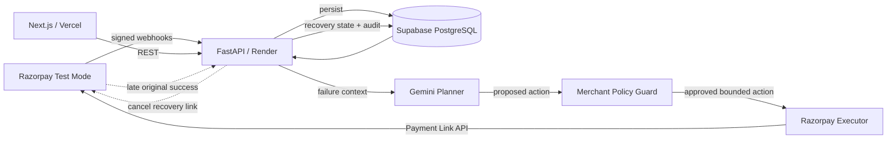

# RecoverFlow

**AI-powered revenue recovery for failed Razorpay payments — without blind retries.**

RecoverFlow is a merchant-side recovery agent that diagnoses failed payments, proposes a bounded next action with Gemini, enforces deterministic merchant safety rules, executes real Razorpay Test Mode Payment Links, and stops recovery if the original payment succeeds late.

> **Core principle:** AI proposes. Policy decides. Razorpay executes.

## Live demo

- **Product:** https://recoverflow-kohl.vercel.app
- **Judge Demo Mode:** https://recoverflow-kohl.vercel.app/demo
- **API:** https://recoverflow-api-ul43.onrender.com
- **Swagger:** https://recoverflow-api-ul43.onrender.com/docs

> Render uses a free instance, so the first backend request after inactivity can take several seconds while the service wakes up.

## Why RecoverFlow

A failed payment does not always mean the same thing:

- a customer may enter the wrong OTP,
- the customer may have insufficient funds,
- the bank or gateway may be temporarily unavailable,
- the final payment state may be uncertain,
- or the original payment may succeed late after initially appearing to fail.

Blindly retrying all failures can create poor customer experience and, in uncertain-state cases, duplicate-charge risk. RecoverFlow diagnoses the context first and chooses one of three bounded actions:

1. `CREATE_RECOVERY_LINK` — safe customer-fixable failures,
2. `WAIT_AND_VERIFY` — transient/uncertain final states,
3. `ESCALATE` — ambiguous, suspicious or policy-sensitive cases.

## What is implemented

- Signed Razorpay webhook verification using raw-body HMAC SHA-256.
- Event-id idempotency using `X-Razorpay-Event-Id`.
- Fast webhook acknowledgement with background processing.
- Gemini structured recovery planning.
- Deterministic fallback when AI is unavailable.
- Merchant-configurable autonomous amount, confidence and attempt limits.
- Real Razorpay Test Mode Payment Link creation.
- Payment Link reconciliation and `payment_link.paid` webhook recovery confirmation.
- Late-success detection on `payment.authorized` / `payment.captured`.
- Automatic cancellation of open recovery links to prevent duplicate collection.
- Per-case audit trail.
- Multi-scenario Simulation Lab.
- Versioned 30-case synthetic evaluation dataset (`rf-synth-v1`).
- Blinded RecoverFlow vs blind-retry benchmark.
- Persistent evaluation analytics and benchmark history.
- Automated backend tests + frontend lint/build GitHub Actions CI.
- Public deployment on Vercel + Render + Supabase.

## Architecture



See [`docs/ARCHITECTURE.md`](docs/ARCHITECTURE.md) for the detailed decision and safety flow.

## Safety model

RecoverFlow intentionally separates model reasoning from money-moving execution.

The Gemini planner can recommend an action, but the executor independently checks:

- merchant-configured maximum autonomous amount,
- minimum AI confidence,
- maximum autonomous recovery attempts,
- whether autonomous Payment Link creation is enabled,
- case terminal state,
- late-success / duplicate-charge protection.

`WAIT_AND_VERIFY`, `ESCALATE`, and duplicate-charge protection are mandatory safety exits and cannot be disabled by merchant configuration.

## Evaluation

RecoverFlow includes a versioned synthetic benchmark dataset, `rf-synth-v1`, containing 30 labelled Razorpay-style failure scenarios across:

- customer-fixable failures,
- transient bank/gateway failures,
- ambiguous failures,
- high-value boundary cases,
- suspicious retry patterns,
- late-success-sensitive cases.

Ground-truth labels are **withheld from Gemini during benchmark inference**. The same cases are compared against a deliberately naive baseline that creates a fresh recovery link for every failure.

The benchmark reports:

- decision accuracy,
- autonomous-action precision,
- unsafe collection attempts,
- duplicate-risk exposures,
- high-value autonomous attempts,
- recovery-opportunity capture,
- safe-deferral accuracy.

All evaluation numbers are clearly labelled **synthetic** and are not represented as production merchant performance.

## Demo routes

| Route | Purpose |
| --- | --- |
| `/` | Main merchant recovery dashboard |
| `/demo` | Judge-facing demo command center |
| `/simulator` | Multi-scenario failure simulator |
| `/evaluation` | Synthetic dataset explorer |
| `/benchmark` | Live AI vs blind-retry benchmark |
| `/analytics/evaluation` | Persistent benchmark analytics |
| `/settings/policy` | Merchant safety controls |

## Tech stack

### Frontend
- Next.js 16
- React 19
- TypeScript
- Tailwind CSS
- Vercel

### Backend
- FastAPI
- Python 3.12
- SQLAlchemy
- PostgreSQL via Supabase
- Gemini structured output
- Razorpay APIs + signed webhooks
- Render

### Quality
- Pytest
- ESLint
- Next.js production build validation
- GitHub Actions CI

## Local setup

### 1. Clone

```powershell
git clone https://github.com/ParvBhawsar/recoverflow.git
cd recoverflow
```

### 2. Backend environment

Copy:

```text
backend/.env.example -> backend/.env
```

Fill your own Supabase, Razorpay Test Mode and Gemini values. Never commit real secrets.

### 3. Install

```powershell
.\scripts\setup.ps1
```

### 4. Validate the whole project

```powershell
.\scripts\check.ps1
```

This validates backend compilation/imports, automated tests, Supabase connectivity, frontend ESLint and a Next.js production build.

### 5. Run

```powershell
.\scripts\dev.ps1
```

Local URLs:

- Frontend: http://localhost:3000
- API: http://127.0.0.1:8000
- Swagger: http://127.0.0.1:8000/docs
- Readiness: http://127.0.0.1:8000/health/ready

## Production smoke test

```powershell
.\scripts\smoke-prod.ps1 `
  -BackendUrl "https://recoverflow-api-ul43.onrender.com" `
  -FrontendUrl "https://recoverflow-kohl.vercel.app"
```

The smoke test checks the API root, database readiness, merchant policy, synthetic dataset, all major frontend routes, and production CORS.

## Webhook events used

RecoverFlow listens for:

- `payment.failed`
- `payment.authorized`
- `payment.captured`
- `payment_link.paid`

Production webhook endpoint:

```text
POST /webhooks/razorpay
```

See [`docs/API.md`](docs/API.md) for endpoint details.

## Repository structure

```text
recoverflow/
├── frontend/                  # Next.js merchant product
├── backend/
│   ├── app/api/               # FastAPI routes
│   ├── app/models/            # SQLAlchemy models
│   ├── app/services/          # AI, policy, Razorpay and evaluation logic
│   └── tests/                 # Backend unit tests
├── docs/
│   ├── ARCHITECTURE.md
│   ├── API.md
│   ├── DEPLOYMENT.md
│   └── PROJECT_ROADMAP.md
├── scripts/                   # setup, diagnostics and smoke tests
├── .github/workflows/ci.yml
└── render.yaml
```

## Security

No production/test credentials are stored in the repository. Local secret files are ignored by Git, deployment secrets live in Render/Vercel environment settings, and webhook signatures are verified before events are accepted.

See [`SECURITY.md`](SECURITY.md).

## Buildathon status

RecoverFlow is a buildathon prototype built to demonstrate a safer revenue-recovery architecture using real Razorpay Test Mode infrastructure. It is not a production financial product and should not be used with live payments without further security, observability, migration, retry-queue, tenancy and compliance work.
