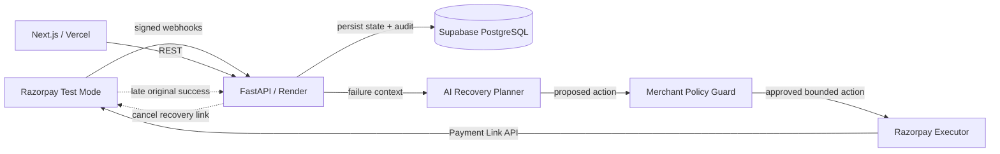

# RecoverFlow

**AI-assisted revenue recovery for failed Razorpay payments — without blind retries.**

RecoverFlow is a merchant-side recovery control plane that diagnoses failed payments, proposes a bounded next action with AI, enforces deterministic merchant safeguards, executes recovery through Razorpay Payment Links, and stops collection when an original payment succeeds late.

> **AI proposes. Policy decides. Razorpay executes.**

## Live product

- Product: https://recoverflow-kohl.vercel.app
- Merchant console: https://recoverflow-kohl.vercel.app/dashboard
- Recovery cases: https://recoverflow-kohl.vercel.app/cases
- Recovery insights: https://recoverflow-kohl.vercel.app/analytics
- API: https://recoverflow-api-ul43.onrender.com
- Swagger: https://recoverflow-api-ul43.onrender.com/docs

> The Render service uses a free instance, so the first backend request after inactivity can be slower while the service wakes up.

## Why RecoverFlow

A failed payment can represent very different states:

- a customer entered the wrong OTP,
- the customer has insufficient funds,
- a bank or gateway is temporarily unavailable,
- the final state is uncertain after a timeout,
- or the original payment succeeds late after initially appearing to fail.

Treating every failure as a retry opportunity creates unnecessary collection attempts and duplicate-charge risk. RecoverFlow first interprets the payment context, then chooses one of three bounded actions:

1. `CREATE_RECOVERY_LINK` — for safe, customer-fixable failures,
2. `WAIT_AND_VERIFY` — for transient or uncertain payment states,
3. `ESCALATE` — for ambiguous, suspicious, high-value or policy-sensitive cases.

## Merchant product surfaces

| Route | Purpose |
| --- | --- |
| `/` | Product landing page |
| `/dashboard` | Merchant recovery overview |
| `/cases` | Full recovery-case workspace |
| `/analytics` | Live recovery performance and failure insights |
| `/settings/policy` | Merchant safeguards |
| `/simulator` | Test-mode recovery sandbox |

### Technical validation surfaces

These are deliberately kept out of the primary merchant navigation and are intended for engineering/review workflows:

| Route | Purpose |
| --- | --- |
| `/analytics/evaluation` | Synthetic model-validation analytics |
| `/benchmark` | Strategy benchmark vs blind retry |
| `/evaluation` | Labelled synthetic evaluation dataset |

## Core capabilities

- Signed Razorpay webhook verification with raw-body HMAC SHA-256.
- Event-id idempotency using `X-Razorpay-Event-Id`.
- Fast webhook acknowledgement with background processing.
- Structured AI recovery planning.
- Deterministic fallback when AI is unavailable.
- Merchant-configurable amount, confidence and attempt limits.
- Real Razorpay Test Mode Payment Link creation.
- `payment_link.paid` webhook recovery confirmation.
- Late-success detection on `payment.authorized` / `payment.captured`.
- Automatic cancellation of open recovery links to prevent duplicate collection.
- Per-case audit trail.
- Multi-scenario recovery sandbox.
- Versioned 30-case synthetic evaluation dataset (`rf-synth-v1`).
- Blinded RecoverFlow vs blind-retry benchmark.
- Persistent evaluation analytics and benchmark history.
- Automated backend tests + frontend lint/build GitHub Actions CI.
- Public deployment on Vercel + Render + Supabase.

## Architecture



Detailed design: [`docs/ARCHITECTURE.md`](docs/ARCHITECTURE.md)

## Safety model

Model reasoning is deliberately separated from money-moving execution.

Before an autonomous recovery link can be created, RecoverFlow independently checks:

- merchant-configured maximum autonomous amount,
- minimum model confidence,
- maximum autonomous recovery attempts,
- whether Payment Link creation is enabled,
- terminal case state,
- duplicate-charge / late-success protection.

`WAIT_AND_VERIFY`, `ESCALATE`, and duplicate-charge protection remain mandatory safety exits.

## Evaluation

RecoverFlow includes `rf-synth-v1`, a versioned synthetic benchmark containing 30 labelled Razorpay-style payment failures across customer-fixable failures, transient bank/gateway failures, ambiguous states, high-value boundary cases, suspicious retry patterns, and late-success-sensitive cases.

Ground-truth labels are withheld during model inference. The same cases are compared against a deliberately naive baseline that opens a recovery path for every failure.

All benchmark results are explicitly synthetic and are not represented as production merchant performance.

## Tech stack

### Frontend
- Next.js 16
- React 19
- TypeScript
- Tailwind CSS 4
- Vercel

### Backend
- FastAPI
- Python 3.12
- SQLAlchemy
- Supabase PostgreSQL
- Gemini structured output
- Razorpay APIs + signed webhooks
- Render

### Quality
- Pytest
- ESLint
- Next.js production-build validation
- GitHub Actions CI

## Local development

```powershell
git clone https://github.com/ParvBhawsar/recoverflow.git
cd recoverflow
```

Copy `backend/.env.example` to `backend/.env`, add your own Supabase/Razorpay Test Mode/Gemini credentials, then run:

```powershell
.\scripts\setup.ps1
.\scripts\check.ps1
.\scripts\dev.ps1
```

Local endpoints:

- Product: http://localhost:3000
- Merchant console: http://localhost:3000/dashboard
- Recovery cases: http://localhost:3000/cases
- Recovery insights: http://localhost:3000/analytics
- API: http://127.0.0.1:8000
- Swagger: http://127.0.0.1:8000/docs
- Readiness: http://127.0.0.1:8000/health/ready

## Production smoke test

```powershell
.\scripts\smoke-prod.ps1 `
  -BackendUrl "https://recoverflow-api-ul43.onrender.com" `
  -FrontendUrl "https://recoverflow-kohl.vercel.app"
```

## Webhook events

RecoverFlow listens for:

- `payment.failed`
- `payment.authorized`
- `payment.captured`
- `payment_link.paid`

Webhook endpoint: `POST /webhooks/razorpay`

API reference: [`docs/API.md`](docs/API.md)

## Repository structure

```text
recoverflow/
├── frontend/                  # Next.js product UI
├── backend/
│   ├── app/api/               # FastAPI routes
│   ├── app/models/            # SQLAlchemy models
│   ├── app/services/          # AI, policy, Razorpay and evaluation logic
│   └── tests/                 # Backend unit tests
├── docs/
│   ├── ARCHITECTURE.md
│   ├── API.md
│   └── DEPLOYMENT.md
├── scripts/                   # setup, diagnostics and smoke tests
├── .github/workflows/ci.yml
└── render.yaml
```

## Security

No API credentials are stored in the repository. Local secret files are ignored by Git, deployment secrets live in Render/Vercel environment settings, and Razorpay webhook signatures are verified before events are accepted.

See [`SECURITY.md`](SECURITY.md).
