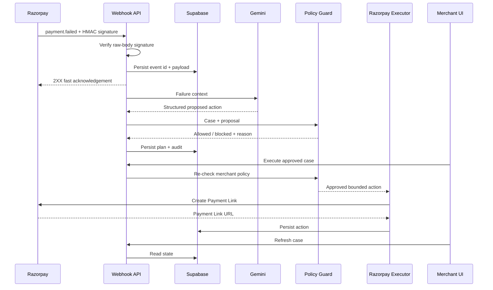
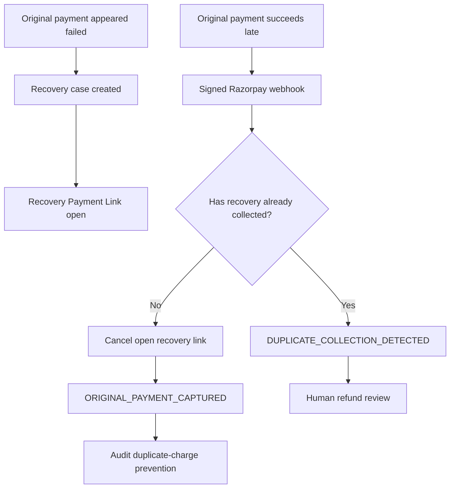

# RecoverFlow Architecture

## System goal

RecoverFlow is designed around one principle: **payment recovery should be contextual and bounded, not a blind retry loop**.

The system separates diagnosis, policy enforcement, execution and auditability so an AI recommendation cannot directly move money.

## High-level flow



## Late-success protection

A key design problem is final-state uncertainty. A payment can initially appear failed because of a gateway/network timeout, then later become authorized or captured.

RecoverFlow handles this using signed `payment.authorized` / `payment.captured` webhooks:



This is the system's main safety differentiator over blindly launching a new payment attempt after every failure.

## Decision model

### Gemini planner

The model receives only payment failure context:

- amount
- currency
- payment method
- error code
- error source
- error step
- error reason

It returns structured fields:

- diagnosis
- confidence
- recommended action
- delay
- operational reason
- customer tone

The model cannot call Razorpay directly.

### Deterministic fallback

If Gemini is unavailable, RecoverFlow falls back to deterministic recovery rules:

- known customer-fixable failures → `CREATE_RECOVERY_LINK`
- transient bank/gateway/final-state uncertainty → `WAIT_AND_VERIFY`
- ambiguous or unsafe cases → `ESCALATE`

### Merchant policy guard

Before any new collection path is created, RecoverFlow independently checks persisted merchant policy:

- maximum autonomous amount
- minimum confidence
- maximum autonomous attempt count
- whether autonomous link creation is enabled
- terminal/protected case state

Mandatory invariants:

- `WAIT_AND_VERIFY` cannot be disabled
- `ESCALATE` cannot be disabled
- duplicate-charge protection cannot be disabled

## Webhook architecture

### Security

Incoming Razorpay webhook bodies are verified with HMAC SHA-256 using the configured `RAZORPAY_WEBHOOK_SECRET` and the exact raw request body.

### Idempotency

`X-Razorpay-Event-Id` is stored in `webhook_events.event_id`, which has a unique constraint. Duplicate deliveries return successfully without creating duplicate work.

### Fast acknowledgement

The request path is intentionally kept short:

1. read raw body
2. verify signature
3. parse payload
4. check/store unique event id
5. commit
6. return 2XX
7. process the event in a background task

This keeps AI/Razorpay downstream calls out of the webhook acknowledgement window.

## Persistence model

Major SQLAlchemy entities:

- `Payment` — original Razorpay payment state and failure context
- `RecoveryCase` — merchant-facing recovery state machine
- `AIPlan` — structured model/fallback recommendation
- `RecoveryAction` — executed Payment Link / external recovery action
- `AuditLog` — human-readable operational trace
- `WebhookEvent` — signed incoming event + idempotency record
- `MerchantPolicy` — persistent runtime safety rules
- `BenchmarkRun` — persisted synthetic evaluation evidence

## Recovery state examples

Typical case states include:

- `ACTION_PROPOSED`
- `WAITING_FOR_CUSTOMER`
- `RECOVERED`
- `ORIGINAL_PAYMENT_CAPTURED`
- `PROTECTION_ATTENTION_REQUIRED`
- `DUPLICATE_COLLECTION_DETECTED`

## Evaluation architecture

RecoverFlow uses the versioned synthetic dataset `rf-synth-v1`.

The model is evaluated in one batch with ground-truth labels withheld. Its actions are then policy-normalized and compared with a blind-retry baseline that selects `CREATE_RECOVERY_LINK` for every failed payment.

Metrics include decision accuracy, unsafe autonomous attempts and duplicate-risk exposure.

This benchmark is explicitly synthetic and must not be represented as production merchant performance.

## Deployment

```text
Browser
  ↓
Vercel — Next.js frontend
  ↓ HTTPS REST
Render — FastAPI backend
  ↓
Supabase — PostgreSQL
  ↕
Gemini API
  ↕
Razorpay Test Mode APIs + Webhooks
```

## Current Test Mode scope and live-traffic hardening

The deployed system is production-shaped but intentionally restricted to Razorpay Test Mode. Before processing live customer payments, complete a formal hardening phase covering:

- multi-merchant authentication and tenant isolation
- database migrations instead of startup `create_all`
- durable background queues instead of in-process background tasks
- structured observability and alerting
- webhook dead-letter / replay tooling
- rate limiting
- encrypted secret management and key rotation procedures
- richer fraud/risk integration
- formal SLOs and load testing
- live-payment security/compliance review
